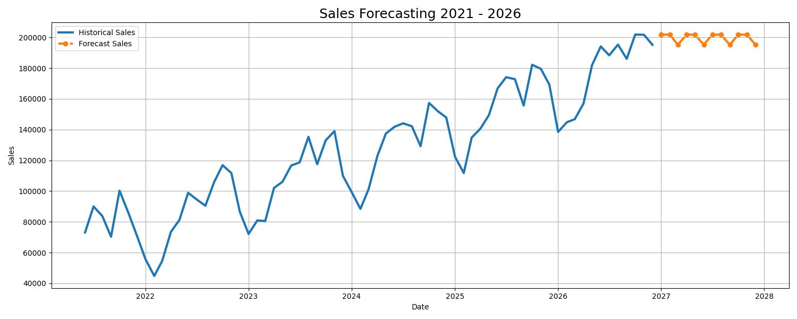

# 📈 Advanced Sales Forecasting using Machine Learning

## 🚀 Project Overview

This project is an advanced Machine Learning based Sales Forecasting System developed using Python and Scikit-learn.  
The system analyzes historical sales data and predicts future sales trends using multiple machine learning algorithms.

The project includes:
- Sales trend analysis
- Seasonal forecasting
- Festival impact prediction
- Feature engineering
- Graph visualization
- JSON result export
- Multi-model performance comparison

---

# 🧠 Machine Learning Models Used

1. Linear Regression
2. Random Forest Regressor
3. Gradient Boosting Regressor

---

# 📊 Features Implemented

✅ Realistic sales data generation  
✅ Seasonal sales trends  
✅ Festival season impact  
✅ Rolling average features  
✅ Lag-based forecasting  
✅ Future sales prediction till 2026  
✅ Graph visualization using Matplotlib  
✅ JSON output generation  
✅ Feature importance analysis  
✅ Model evaluation metrics  

---

# 🛠 Technologies Used

- Python
- Pandas
- NumPy
- Matplotlib
- Scikit-learn
- JSON

---

# 📂 Project Structure

```text
Sales_Forecasting_ML/
│
├── sales_forecast.py
├── results.json
├── sales_forecast_graph.png
├── requirements.txt
└── README.md
```

---

# 📈 Forecasting Features

The project predicts:
- Monthly future sales
- Business growth trends
- Festival sales impact
- Seasonal demand patterns

---

# 📊 Evaluation Metrics

The models are evaluated using:

- MAE (Mean Absolute Error)
- RMSE (Root Mean Squared Error)
- R² Score

---

# 🔮 Future Forecast

The system forecasts sales for future months till 2026 using trained machine learning models.

---

# 📷 Output Graph

The project automatically generates a sales forecasting graph.

## Historical + Future Forecast Visualization



---

# 📁 Output Files

## results.json
Stores:
- Forecast results
- Model performance
- Best model details

## sales_forecast_graph.png
Generated graph visualization

---

# ▶️ How to Run the Project

## Step 1: Install dependencies

```bash
pip install -r requirements.txt
```

## Step 2: Run the project

```bash
python sales_forecast.py
```

---

# 📦 requirements.txt

```text
pandas
numpy
matplotlib
scikit-learn
```

---

# 🎯 Real World Applications

This project can be used in:

- Retail Stores
- E-commerce Platforms
- Inventory Management
- Business Analytics
- Revenue Forecasting
- Marketing Analysis

---

# 💡 Key Highlights

- Multiple ML models comparison
- Advanced feature engineering
- Realistic forecasting pipeline
- Clean visualization
- Professional project structure

---

# 👨‍💻 Author

Developed by Teku Triveni

---

# ⭐ Conclusion

This project demonstrates the practical implementation of Machine Learning for business sales forecasting and predictive analytics using Python.
